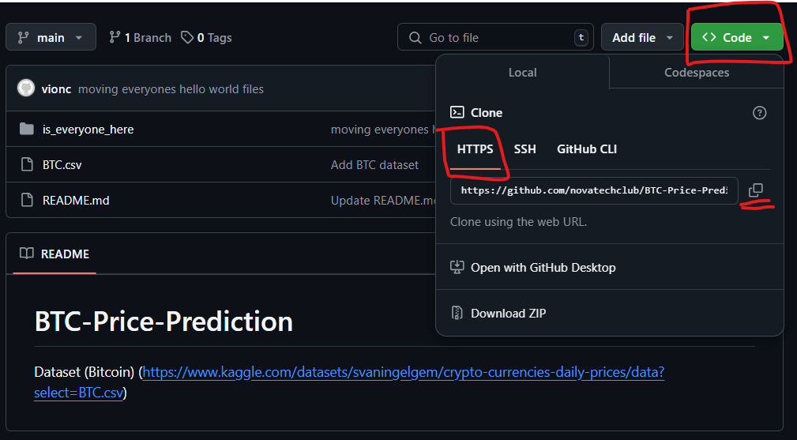

# Git Workflow in Visual Studio Code

This notebook will guide you through the basics of using Git within Visual Studio Code. You'll learn how to navigate using the terminal, initialize a Git repository, commit changes to a local branch, and push them to a remote repository.

## Prerequisites
- Install Git ([Download here](https://git-scm.com/downloads))
- Install Visual Studio Code ([Download here](https://code.visualstudio.com/))
- Set up Git in VS Code (Follow [this guide](https://code.visualstudio.com/docs/editor/versioncontrol#_git-support))

Let's get started!

## File Structure

0. Introduction to Git Workflow
1. Navigating using the Terminal
2. Cloning a remote repository
3. Initializing a Git Repository
4. Staging and Committing Changes
5. Connecting to a Remote Repository
6. Pushing Changes to the Remote Repository
7. Pulling Changes from the Remote Repository
8. Summary of Git Commands

<br>
<br>
<br>
<br>
<br>
<br>
<br>
<br>
<br>
<br>

### Why this is important?


<br>
<br>
<br>
<br>
<br><br>
<br>
<br>

- Git is a standard solutioin for version control and workflow management in small to large scale software projects.
- It is useful to organize remote work with on site teams.
- Supports the effective operationalization of Dev and Prod Teams to work together hand in hand.
- you will get a bombastic side eye from your collegaues if you decided to work within software engineering without knowing how to navigate and use Git or the terminal.

## 0. Introduction to the Git Workflow


## 1. Navigating using the Terminal

To begin, open the terminal in VS Code by pressing **Ctrl+`** (or **Cmd+`** on macOS). This terminal is where you'll execute all your Git commands.


```python
!pwd  # Print the current working directory (or use 'cd' to navigate)
```


```python
!cd <path>  # Change the current working directory to specified path
```


```python
!cd ~n # Change the current working directory to the home directory of user 'n'
```


```python
!cd ..  # Change the current working directory to the parent directory (one level up)
```


```python
!ls  # List the contents of the current directory for apple it might be ls -la
```


```python
!mv original/file/path/filename destination/file/path  # moving files between folders
```

## 2. Cloning a remote repository and Branching

In order to collaborate as a team, each of us has to clone the current remote repositories version.  

You have to options to clone a repository:

##### 1. via https (not recommended unless ssh makes problems as https requires you to insert your credentials and a user token to clone the repository sometimes.



##### 2. via ssh


```python
!git clone <repo>  # Clone a repository into a new directory
```


```python
!git branch  # List all local branches in the current repository
```


```python
!git branch branch_name  # Create a new branch
```


```python
!git checkout branch_name  # Switch to the specified branch
```


```python
!git fetch  # Download objects and refs from another repository
```


```python
!git fetch --all  # Fetch all remotes
```

## 3. Initializing a Git Repository

To track changes in your project, you need to initialize a Git repository. Navigate to your project folder and run the following command:


```python
!git init  # Initialize a new Git repository in the current directory
```

After running this command, you'll see a `.git` folder in your directory. This folder contains all the information Git needs to track changes.

## 4. Staging and Committing Changes

When you make changes to your files, Git doesn't automatically track them. You need to stage these changes and then commit them.


```python
!git status  # Check the status of your repository
```


```python
!git add .  # Stage all changes (you can also stage specific files by replacing '.' with the file name)
```


```python
!git add name_of_file  # Stage a specific file
```


```python
!git add -u  # Stage all changes except untracked files
```


```python
!git add name_of_file_1 name_of_file_2 name_of_file_3 # stage multiple files at once
```


```python
!git restore --staged name_of_file  # Unstage a file
```


```python
!git commit -m 'Initial commit'  # Commit the staged changes with a message (message can be whatever message you prefer)
```


```python
!git log  # Display the commit history
```

## 5. Connecting to a Remote Repository

To share your work, you'll need to connect your local repository to a remote repository on a platform like GitHub, GitLab, or Bitbucket.


```python
!git remote add origin <remote_url>  # Replace <remote_url> with the URL of your remote repository
```


```python
!git remote -v  # Verify that the remote has been added correctly
```

## 6. Pushing Changes to the Remote Repository

After connecting your repository, you can push your local commits to the remote repository.


```python
!git branch -M main  # Rename the default branch to 'main' (if needed)
```


```python
!git push -u origin main  # Push your changes to the remote repository
```

## 7. Pulling Changes from the Remote Repository

If you're collaborating with others, you may need to pull their changes before making your own. Run:


```python
!git pull origin main  # Pull the latest changes from the remote repository
```

## 8. Summary of Git Commands

- `git init`: Initialize a new Git repository
- `git status`: Check the status of your repository
- `git add .`: Stage changes
- `git commit -m 'message'`: Commit staged changes
- `git remote add origin <url>`: Add a remote repository
- `git push`: Push changes to the remote repository
- `git pull`: Pull changes from the remote repository

Happy coding!
