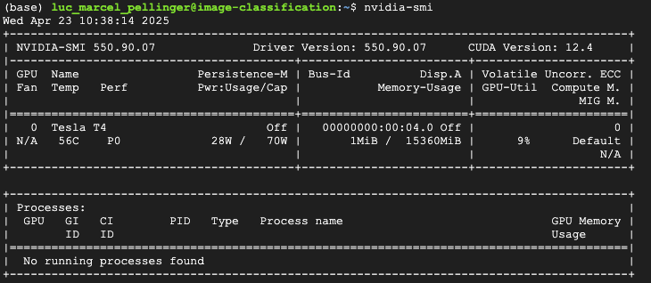
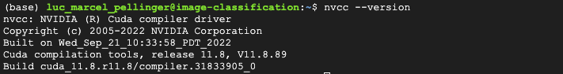
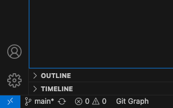
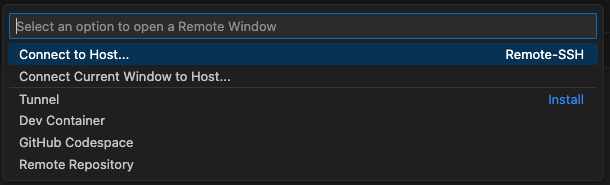
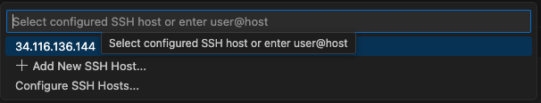
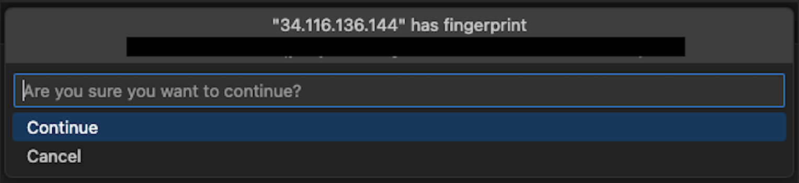
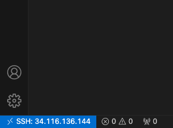

# Google Cloud Setup Tutorial

This document works as a quick tutorial on how to setup a cloud compute engine as virtual machine on google cloud to use a T4 GPU via a remote host connection in VSCode.
It has the purpose to support the work during machine learning development.

Dependencies:


Before jumping into the tutorial, please create a google cloud account and ensure you have your account activated. --> [Google Cloud](https://cloud.google.com/gcp?utm_source=google&utm_medium=cpc&utm_campaign=emea-de-all-de-bkws-all-all-trial-e-gcp-1707574&utm_content=text-ad-none-any-DEV_c-CRE_529379242747-ADGP_Hybrid+%7C+BKWS+-+EXA+%7C+Txt+-+GCP+-+General+-+v3-KWID_43700060393213364-kwd-6458750523-userloc_9041832&utm_term=KW_google+cloud-NET_g-PLAC_&&gad_source=1&gclid=CjwKCAjwn6LABhBSEiwAsNJrjlYSo93y2CTKff3jPC5ziNHK9MhgLO_wpLofE4KhPkvL1YUG7z-UexoC1hkQAvD_BwE&gclsrc=aw.ds&hl=en)

You should also install [VSCode](https://code.visualstudio.com/).


## **Step 1: Crreating your first project**

After creating your google cloud platform account, you can now jump into the first step which is creating your first project. For this, simply click on the following box and choose an existing project or create a new one:


---
## **Step 2: Enabling GCP Compute Engine API**

---
## **Step 3: Creating a compute engine as virtual machine instance**

In the next step, a new compute instance will be configured. 

We will configure it so that you can immediately use it for your work. 

Here is a quick rundown on how we will configure it:

<Setup info here>

---
## **Step 4: NVIDIA drivers and cuda installation**

To install the drivers, simply choose **"y"** upon request in the browser console. 

---
## **Step 5: Confirming proper Installation of NVIDIA Drivers & CUDA**

To confirm the proper installation of the drivers and CUDA, run the following commands in the in browser-console:

---
#### **Verification of the correct Installation**
```bash
~$ nvidia-smi
```

**You should receive the following output:**



---
#### Verification of the CUDA Version
```bash
~$ nvcc --version
```

**You should receive the following output:**



---
## **Step 6: Connecting to the instance from the local machine**

### **Step 6.1: Generating Public Key & Setting in GCloud Console**

**6.1.1: Open your terminal**

**6.1.2: Navigate to your home directory**
```bash 
cd ~
```

**6.1.3: check current directory path**
```bash 
pwd
```
**6.1.4: check if .ssh folder exists**
```bash 
ls -la
```
**6.1.5: Jump into the .ssh folder and list the files in it**
```bash 
cd .ssh && ls -la
```

**6.1.6: Create a new ssh key pair for your google cloud instance**
```bash 
ssh-keygen -t rsa -b 2048 -f /Users/lucpellinger/.ssh/google_compute_engine
```
- **remember to just press enter for the commands in the console in case you dont want to add a pass-phrase.**

**6.1.7: Reading the public key and copying it into Google Cloud Console**

```bash 
cat google_compute_engine.pub
```

- now copy the entire output
- open GCP and click on your instance
- Click Edit
- Go to SSH Keys section
- Click add item and paste in your new key
- locate the **user name** for the ssh public key in the Details section of your instance and remember it
- click arrow to jump back 
- find the **external IP** adress of your instance (remember it changes every time you the instance is restarted unless you pay for a constant IP address)

---

### **Step 6.2: Connect the instance with your local machine using your local Terminal****

**6.2.1: navigate to your home directory** 

```bash
cd ~
```

**6.2.2: Connect to the remote host** 
```bash
<example here:> ssh -i <directory for the google cloud ssh key> <usernmae>@<external IP>
ssh -i /Users/lucpellinger/.ssh/google_compute_engine lucpellinger@34.116.246.96
```

**identify existing ssh processes**

```bash
ps aux | grep ssh
```

**6.2.3: Stop connection again and clean list of known hosts**

```bash
exit
```

**remove IP from remote host from list of known hosts**

```bash
ssh-keygen -R <hostname_or_IP>
```

**verify if removal was successful using**

```bash
code ~/.ssh/known_hosts
```
---

### **Step 6.3: Connect to the remote host using VSCode****

**6.3.1: Open VSCode and click the blue >< sign**



**then click the following**



**insert the host ip address and click enter or select it from existing ones (verify if correct)**



**verify IP and click continue**



**check if verification was successful**



**6.3.2: create new .ssh key pair on remote host**

```bash
cd ~
cd .ssh
ssh-keygen -t rsa -b 2048 -f /home/lucpellinger/.ssh/github
```

**add key to ssh agent**

Start agent via

```bash
eval "$(ssh-agent -s)"
```

**Register new key pair**

```bash
ssh-add ~/.ssh/github
ssh-add -l
ssh -T git@github.com
```

**6.3.3: Clone Repository where you want it**

```bash
git clone <sshurl>
```

**6.3.4: Create new conda env and install requirements.txt or conda environment.yml**

```bash
conda env list
conda activate <env_name>
conda list
conda env create -f environment.yml
```

**6.3.5: When done working comit all changes, disconnect VSCode and shutdown remote host in GCP Compute Engine.**

---

## **7. When reconnecting change IP address in config file under ~/.ssh/config** 

```bash
cd ~ && cd .ssh && code config
```
